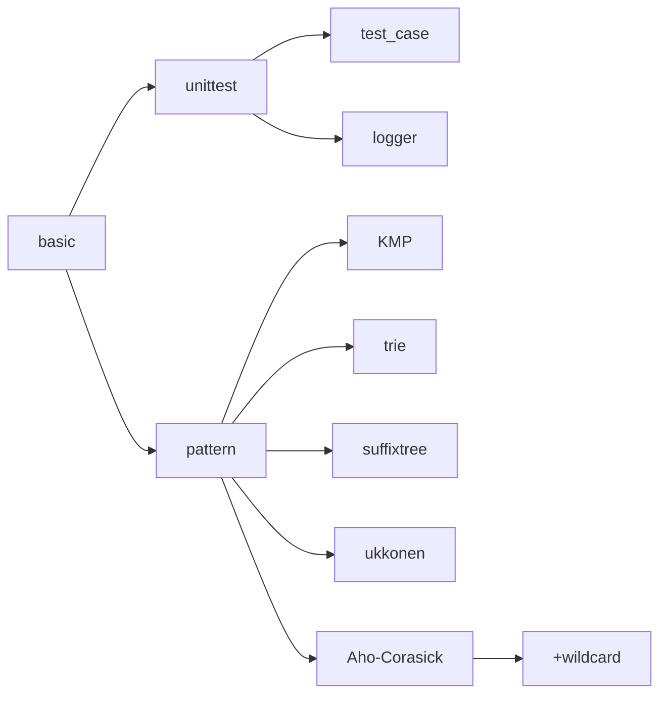
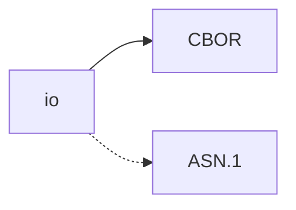
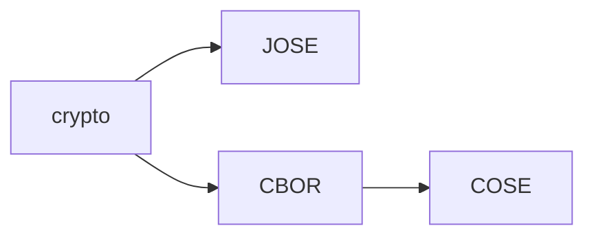
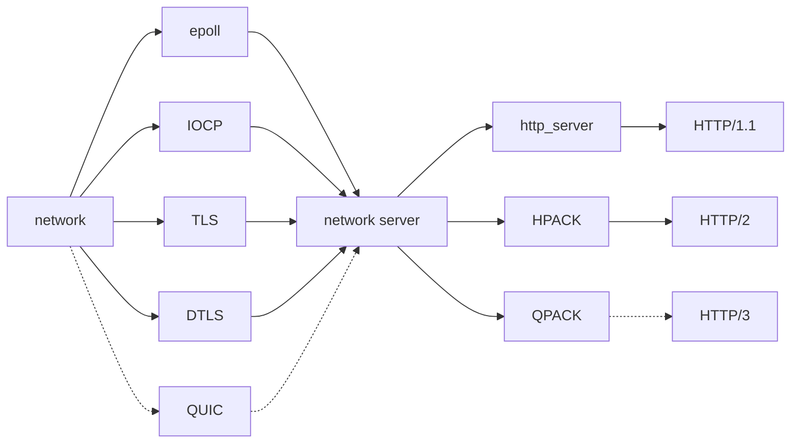

## Notes

- [Plan](#plan)
- [Memo](#memo)
- [TODO](#todo)

### Plan

#### basic

#### io

- holding
  - asn1

#### crypto

#### net

- TODO
  - QUIC, HTTP/3

## Memo

### openssl

- execution failure cause of DLL binding error
; after updating MINGW (pacman -Suy), test application do not work

| API                   | minimum version |
| --                    | --              |
| BIO_err_is_non_fatal  | openssl 3.2~    |
| OPENSSL_LH_set_thunks | openssl 3.3~    |

- feature

| feature | API                   | minimum version |
| --      | --                    | --              |
| QUIC    | SSL_new_stream        | openssl 3.2~    |
| KDF     | OSSL_set_max_threads  | openssl 3.2~    |

## TODO

- [ ] HTTP/3
- [ ] QUIC
- [x] QPACK
  - [x] encoder
  - [x] static table
  - [x] dynamic table
- [x] HPACK
  - [x] huffman coding
  - [x] encoder
  - [x] static table
  - [x] dynamic table
- [x] UDP/DTLS
  - [x] integration - multiplexer (epoll, IOCP)
  - [x] integration - network_server
- [x] HTTP/2
  - [x] integration - http_server
  - [x] Server Push
- [x] HTTP/1.1
  - [x] integration - http_server
  - [x] Basic Authentication
  - [x] Digest Access Authentication
  - [x] Bearer Authentication
  - [x] OAuth2
- [x] pattern
  - [x] KMP
  - [x] trie
  - [x] suffixtree
  - [x] ukkonen
  - [x] Aho-Corasick
    - [x] wildcard (single ?, any *)
- [x] graph
  - [x] DFS
  - [x] BFS
  - [x] Dijkstra
- [x] COSE
  - [x] CBOR
  - [x] CWK
    - [x] HMAC
    - [x] RSA
    - [x] EC
    - [x] OKP
  - [x] encrypt
  - [x] sign
  - [x] mac
  - [ ] hash
- [x] JOSE
  - [x] JWK
    - [x] HMAC
    - [x] RSA
    - [x] EC
    - [x] OKP
  - [x] JWA
  - [x] JWE
  - [x] JWS
- [ ] ASN.1

sub-tasks

- [ ] shutdown DTLS peer connection
- [ ] br(Brotli), zstd(Zstandard) HTTP encoding
