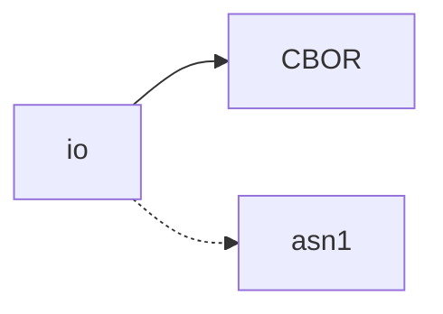
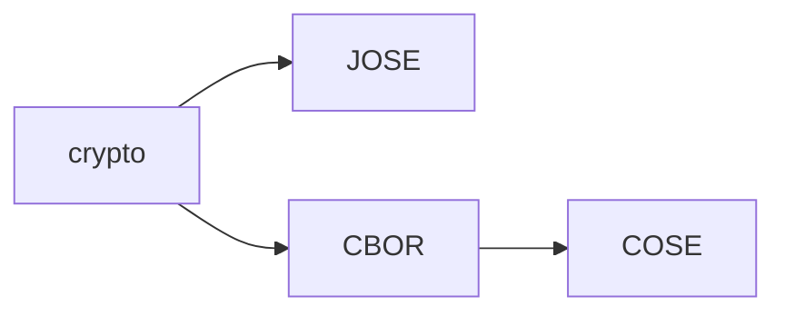
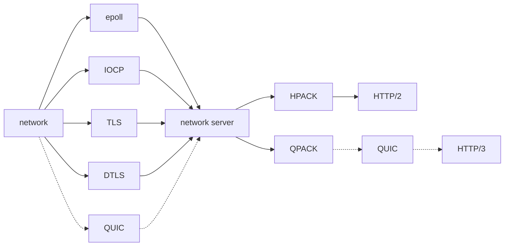

### Plan

#### io

- holding
  - asn1

#### crypto

#### net

- TODO
  - QUIC, HTTP/3

#### 

## Notes

### openssl

- execution failure cause of DLL binding
; after updating MINGW (pacman -Suy), application do not run

| API                   | minimum version |
| --                    | --              |
| BIO_err_is_non_fatal  | openssl 3.2~    |
| OPENSSL_LH_set_thunks | openssl 3.3~    |

- feature

| feature | API                   | minimum version |
| --      | --                    | --              |
| QUIC    | SSL_new_stream        | openssl 3.2~    |

