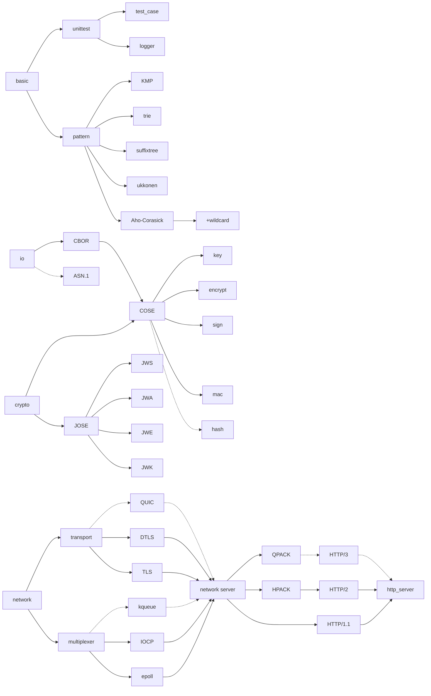

## Notes

- [Plan](#plan)
- [Memo](#memo)
- [TODO](#todo)

### Plan

- in progress
  - TLS
  - QUIC
  - HTTP/3
- holding
  - asn1
- flowchart
  - line : implemented
  - dot-line : not implemented yet

## Memo

### openssl

- execution failure cause of DLL binding error
; after updating MINGW (pacman -Suy), test application do not work

| API                    | version      |
| --                     | --           |
| BIO_err_is_non_fatal   | openssl 3.2~ |
| OPENSSL_LH_set_thunks  | openssl 3.3~ |
| EVP_MD_CTX_get_size_ex | openssl 3.4~ |

- feature

| feature | API                   | minimum version |
| --      | --                    | --              |
| KDF     | OSSL_set_max_threads  | openssl 3.2~    |

## TODO

- [ ] HTTP/3
- [ ] QUIC
- [x] QPACK
  - [x] encoder
  - [x] static table
  - [x] dynamic table
- [x] HPACK
  - [x] huffman coding
  - [x] encoder
  - [x] static table
  - [x] dynamic table
- TLS (understanding record, handshake, extension)
  - [x] tls13.xargs.org
  - [x] tls12.xargs.org
  - [x] dtls.xargs.org
  - [x] RFC 8448
    - [x] 1-RTT
    - [x] 0-RTT
    - [x] HelloRetryRequest
    - [x] Client Authentication
    - [x] compatibility mode
  - [x] verify
    - [x] pre shared key (psk binder)
    - [x] certificate verify
    - [x] finished
  - [x] TLS construct
    - [x] TLS version
      - [x] TLS1.3
      - [x] TLS1.2
    - [x] encryption
      - [x] encryption by cipher mode (not by TLS version)
  - [ ] DTLS construct

- [x] UDP/DTLS
  - [x] integration - multiplexer (epoll, IOCP)
  - [x] integration - network_server
- [x] HTTP/2
  - [x] integration - http_server
  - [x] Server Push
- [x] HTTP/1.1
  - [x] integration - http_server
  - [x] Basic Authentication
  - [x] Digest Access Authentication
  - [x] Bearer Authentication
  - [x] OAuth2
- [x] pattern
  - [x] KMP
  - [x] trie
  - [x] suffixtree
  - [x] ukkonen
  - [x] Aho-Corasick
    - [x] wildcard (single ?, any *)
- [x] graph
  - [x] DFS
  - [x] BFS
  - [x] Dijkstra
- [x] COSE
  - [x] CBOR
  - [x] CWK
    - [x] HMAC
    - [x] RSA
    - [x] EC
    - [x] OKP
  - [x] encrypt
  - [x] sign
  - [x] mac
  - [ ] hash
- [x] JOSE
  - [x] JWK
    - [x] HMAC
    - [x] RSA
    - [x] EC
    - [x] OKP
  - [x] JWA
  - [x] JWE
  - [x] JWS
- [ ] ASN.1

sub-tasks

- [ ] COSE partial iv
- [ ] shutdown DTLS peer connection
- [ ] br(Brotli), zstd(Zstandard) HTTP encoding
- [ ] HTTP/2 Authentication Scheme
