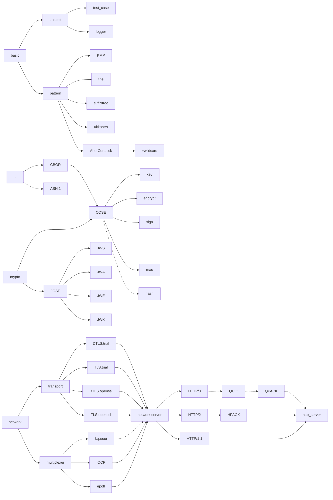

## Notes

- [Release](#release)
- [Plan](#plan)
- [Memo](#memo)
- [TODO](#todo)

### Plan

- in progress
  - QUIC
  - HTTP/3
- holding
  - ASN.1
- flowchart
  - line : implemented
  - dot-line : not implemented yet

```mermaid
flowchart LR
  A[basic];

  AA[unittest];
  AB[pattern];
  A --> AA;
  A --> AB;

  AA1[test_case];
  AA2[logger];
  AB1[KMP];
  AB2[trie];
  AB3[suffixtree];
  AB4[ukkonen];
  AB5[Aho-Corasick];
  AB51[+wildcard];
  AA --> AA1;
  AA --> AA2;
  AB --> AB1;
  AB --> AB2;
  AB --> AB3;
  AB --> AB4;
  AB --> AB5;
  AB5 --> AB51;

  B[io];

  BA[CBOR];
  BB[ASN.1];
  B --> BA;
  B -.-> BB;

  C[crypto];

  CA[JOSE];
  CB[COSE];
  C --> CA;
  C ---> CB;
  BA --> CB;

  CA1[JWS];
  CA2[JWA];
  CA3[JWE];
  CA4[JWK];
  CA --> CA1;
  CA --> CA2;
  CA --> CA3;
  CA --> CA4;

  CB1[key];
  CB2[encrypt];
  CB3[sign];
  CB4[mac];
  CB5[hash];
  CB --> CB1;
  CB --> CB2;
  CB --> CB3;
  CB --> CB4;
  CB -.-> CB5;

  D[network];

  DA[multiplexer];
  DB[transport];
  D --> DA;
  D --> DB;

  DA1[epoll];
  DA2[IOCP];
  DA3[kqueue];
  DA --> DA1;
  DA --> DA2;
  DA -.-> DA3;

  DB1[TLS.openssl];
  DB2[DTLS.openssl];
  DB4[TLS.trial];
  DB5[DTLS.trial];
  DB --> DB1;
  DB --> DB2;
  DB --> DB4;
  DB --> DB5;
  DA1 --> DC;
  DA2 --> DC;
  DA3 -.-> DC;
  DB1 --> DC;
  DB2 --> DC;
  DB4 --> DC;
  DB5 --> DC;

  DC[network server];
  DC1[HTTP/1.1];
  DC2[HTTP/2];
  DC3[HPACK];
  DC4[HTTP/3];
  DC5[QUIC];
  DC6[QPACK];

  DC --> DC1;
  DC --> DC2;
  DC2 --> DC3;
  DC -.-> DC4;
  DC4 -.-> DC5;
  DC5 -.-> DC6;

  DD[http_server];
  DC1 ----> DD;
  DC3 ---> DD;
  DC6 -.-> DD;
```

## Memo

### MSYS2

- debug build not work (gcc >= 15.0)
  - [__glibcxx_requires_subscript assertion](https://gcc.gnu.org/bugzilla/show_bug.cgi?id=111250)
  - debugging in the gdb
    - b abort

### openssl

- execution failure cause of DLL binding error
; after updating MINGW (pacman -Suy), test application do not work

| API                    | version      |
| --                     | --           |
| BIO_err_is_non_fatal   | openssl 3.2~ |
| OPENSSL_LH_set_thunks  | openssl 3.3~ |
| EVP_MD_CTX_get_size_ex | openssl 3.4~ |

- feature

| feature | API                        | minimum version |
| --      | --                         | --              |
|         | EVP_PKEY_CTX_new_from_name | openssl 3.0~    |
|         | EVP_PKEY_get0_type_name    | openssl 3.0~    |
| HPKE    | OSSL_HPKE_seal             | openssl 3.2~    |
| KDF     | OSSL_set_max_threads       | openssl 3.2~    |
| MLKEM   |                            | openssl 3.5~    |

### MSVC
- windbg symbol path
  - srv*C:\home\symbols*https://msdl.microsoft.com/download/symbols

## TODO

- [ ] HTTP/3
  - [x] [The Illustrated QUIC Connection](https://quic.xargs.org/)
  - [x] http3.pcapng
    - [x] pcap
  - [ ] integration - network_server
- [x] QPACK
  - [x] encoder
  - [x] static table
  - [x] dynamic table (rev. 824)
- [x] HPACK
  - [x] huffman coding
  - [x] encoder
  - [x] static table
  - [x] dynamic table
- [ ] TLS (understanding record, handshake, extension)
  - [x] [The Illustrated TLS 1.3 Connection](https://tls13.xargs.org/)
  - [x] [The Illustrated TLS 1.2 Connection](https://tls12.xargs.org/)
  - [x] RFC 8448
    - [x] 1-RTT
    - [x] 0-RTT
    - [x] HelloRetryRequest
    - [x] Client Authentication
    - [x] compatibility mode
  - [x] verify
    - [x] pre shared key (psk binder)
    - [x] certificate verify
    - [x] finished
  - [x] TLS construct
    - [x] TLS1.3
    - [x] TLS1.2 (fixed rev.740)
  - [x] DTLS construct
    - [x] DTLS1.3
    - [x] DTLS1.2 (rev.751, 760)
    - [x] fragmentation (rev.758)
  - [x] TLS over TCP (example netclient)
    - [x] HTTP/1.1
  - [x] DTLS over UDP (rev. 766)
  - [x] encrypt_then_mac (rev.752)
    - [x] encrypt
    - [x] decrypt
  - [x] TLS 1.2 chacha20-poly1305
  - [x] TCP segmentation
  - [x] DTLS 1.2 AEAD (CCM not tested - no test vector)
  - [ ] extensions
- [x] UDP/DTLS
  - [x] integration - multiplexer (epoll, IOCP)
  - [x] [The Illustrated DTLS Connection](https://dtls.xargs.org/)
  - [x] integration - network_server
    - [x] trial_tls_server_socket
    - [x] trial_dtls_server_socket
  - [x] integration - netclient
    - [x] trial_tls_client_socket
    - [x] trial_dtls_client_socket
- [x] HTTP/2
  - [x] integration - http_server
  - [x] Server Push
- [x] HTTP/1.1
  - [x] integration - http_server
  - [x] Basic Authentication
  - [x] Digest Access Authentication
  - [x] Bearer Authentication
  - [x] OAuth2
- [x] pattern
  - [x] KMP
  - [x] trie
  - [x] suffixtree
  - [x] ukkonen
  - [x] Aho-Corasick
    - [x] wildcard (single ?, any *)
- [x] graph
  - [x] DFS
  - [x] BFS
  - [x] Dijkstra
- [x] COSE
  - [x] CBOR
  - [x] CWK
    - [x] HMAC
    - [x] RSA
    - [x] EC
    - [x] OKP
  - [x] encrypt
  - [x] sign
  - [x] mac
  - [ ] hash
- [x] JOSE
  - [x] JWK
    - [x] HMAC
    - [x] RSA
    - [x] EC
    - [x] OKP
  - [x] JWA
  - [x] JWE
  - [x] JWS
- [ ] ASN.1

sub-tasks

- [ ] COSE partial iv
- [ ] shutdown DTLS peer connection
- [ ] br(Brotli), zstd(Zstandard) HTTP encoding
- [ ] HTTP/2 Authentication Scheme
