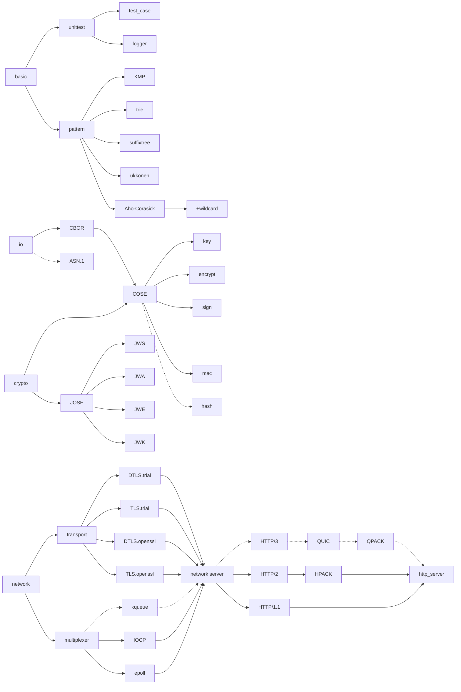

## Notes

- [Plan](#plan)
- [Memo](#memo)

### Plan

- in progress
  - ASN.1 (reboot)
- holding
  - QUIC
  - HTTP/3
- flowchart
  - line : implemented
  - dot-line : not implemented yet

- TODO
  - [ ] ASN.1
    - in progress
      - [ ] ASN.1 runtime
        - [ ] constraints
          - [ ] constraints evaluation
          - [ ] disjoint set (intersection)
          - [x] union
          - [x] intersection
          - [x] except
          - [ ] all_except
        - [ ] decode
      - [ ] ASN.1 AST (Abstract Syntax Tree)
      - [ ] ASN.1 compiler
      - [ ] ASN.1 repository
  - [ ] HTTP/3
    - [x] [The Illustrated QUIC Connection](https://quic.xargs.org/)
    - [x] http3.pcapng
      - [x] pcap
    - [ ] integration - network_server
  - sub-tasks
    - [ ] COSE partial iv
    - [ ] shutdown DTLS peer connection
    - [ ] br(Brotli), zstd(Zstandard) HTTP encoding
    - [ ] HTTP/2 Authentication Scheme

```mermaid
flowchart LR
  A[basic];

  AA[unittest];
  AB[pattern];
  A --> AA;
  A --> AB;

  AA1[test_case];
  AA2[logger];
  AB1[KMP];
  AB2[trie];
  AB3[suffixtree];
  AB4[ukkonen];
  AB5[Aho-Corasick];
  AB51[+wildcard];
  AA --> AA1;
  AA --> AA2;
  AB --> AB1;
  AB --> AB2;
  AB --> AB3;
  AB --> AB4;
  AB --> AB5;
  AB5 --> AB51;

  B[io];

  BA[CBOR];
  BB[ASN.1];
  B --> BA;
  B -.-> BB;

  C[crypto];

  CA[JOSE];
  CB[COSE];
  C --> CA;
  C ---> CB;
  BA --> CB;

  CA1[JWS];
  CA2[JWA];
  CA3[JWE];
  CA4[JWK];
  CA --> CA1;
  CA --> CA2;
  CA --> CA3;
  CA --> CA4;

  CB1[key];
  CB2[encrypt];
  CB3[sign];
  CB4[mac];
  CB5[hash];
  CB --> CB1;
  CB --> CB2;
  CB --> CB3;
  CB --> CB4;
  CB -.-> CB5;

  D[network];

  DA[multiplexer];
  DB[transport];
  D --> DA;
  D --> DB;

  DA1[epoll];
  DA2[IOCP];
  DA3[kqueue];
  DA --> DA1;
  DA --> DA2;
  DA -.-> DA3;

  DB1[TLS.openssl];
  DB2[DTLS.openssl];
  DB4[TLS.trial];
  DB5[DTLS.trial];
  DB --> DB1;
  DB --> DB2;
  DB --> DB4;
  DB --> DB5;
  DA1 --> DC;
  DA2 --> DC;
  DA3 -.-> DC;
  DB1 --> DC;
  DB2 --> DC;
  DB4 --> DC;
  DB5 --> DC;

  DC[network server];
  DC1[HTTP/1.1];
  DC2[HTTP/2];
  DC3[HPACK];
  DC4[HTTP/3];
  DC5[QUIC];
  DC6[QPACK];

  DC --> DC1;
  DC --> DC2;
  DC2 --> DC3;
  DC -.-> DC4;
  DC4 -.-> DC5;
  DC5 -.-> DC6;

  DD[http_server];
  DC1 ----> DD;
  DC3 ---> DD;
  DC6 -.-> DD;
```

### Memo

#### MSYS2

- debug build not work (gcc >= 15.0)
  - [__glibcxx_requires_subscript assertion](https://gcc.gnu.org/bugzilla/show_bug.cgi?id=111250)
  - debugging in the gdb
    - b abort

#### openssl

- execution failure cause of DLL binding error
; after updating MINGW (pacman -Suy), test application do not work

| API                    | version      |
| --                     | --           |
| BIO_err_is_non_fatal   | openssl 3.2~ |
| OPENSSL_LH_set_thunks  | openssl 3.3~ |
| EVP_MD_CTX_get_size_ex | openssl 3.4~ |

- feature

| feature | API                        | minimum version |
| --      | --                         | --              |
|         | EVP_PKEY_CTX_new_from_name | openssl 3.0~    |
|         | EVP_PKEY_get0_type_name    | openssl 3.0~    |
| HPKE    | OSSL_HPKE_seal             | openssl 3.2~    |
| KDF     | OSSL_set_max_threads       | openssl 3.2~    |
| MLKEM   |                            | openssl 3.5~    |

#### MSVC
- windbg symbol path
  - srv*C:\home\symbols*https://msdl.microsoft.com/download/symbols
