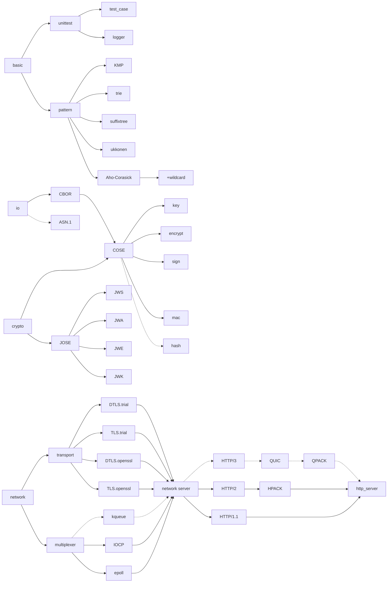

## Notes

- [Article](#article)
- [Plan](#plan)
- [Memo](#memo)

### Article

* SDK
  * base
    * [README](sdk/base/README.md)
  * base - published by Gemini
    * [universal error handling wrapper](sdk/base/error.md)
    * [logger](sdk/base/unittest/logger.md)
    * [testcase](sdk/base/unittest/testcase.md)
    * [command line](sdk/base/basic/cmdline.md)
    * [function pipeline](sdk/base/basic/function_pipeline.md)
    * [valist](sdk/base/basic/valist.md)
    * [basic_stream](sdk/base/stream/basic_stream.md)
    * [sprintf](sdk/base/stream/sprintf.md)
    * [BASE16](sdk/base/encoding/base16.md)
    * [BASE64](sdk/base/encoding/base64.md)
    * [huffman coding](sdk/base/encoding/huffman_coding.md)
    * [encoder stream](sdk/base/encoding/encoder_stream.md)
    * [decoder stream](sdk/base/encoding/decoder_stream.md)
    * [graph](sdk/base/graph/graph.md)
    * [range_set](sdk/base/nostd/range_set.md)
    * [aho_corasick](sdk/base/pattern/aho_corasick.md)
    * [aho_corasick_parser](sdk/base/pattern/aho_corasick_parser.md)
    * [trie](sdk/base/pattern/trie.md)
    * [obfuscate](sdk/base/string/obfuscate.md]
  * io
    * [README](sdk/io/README.md)
    * [ASN.1](sdk/io/asn.1/basic/README.md)
    * [ASN.1](sdk/io/asn.1/basic/semantic/constraints/README.md)
    * [ASN.1](sdk/io/asn.1/basic/structural/README.md)
    * [ASN.1](sdk/io/asn.1/README.md)
    * [ASN.1](sdk/io/asn.1/runtime/README.md)
    * [CBOR](sdk/io/cbor/README.md)
  * io - published by Gemini
    * [parser](sdk/io/basic/parser.md)
    * [payload](sdk/io/basic/payload.md)
    * [CBOR](sdk/io/cbor/cbor.md)
    * [multiplexer](sdk/io/system/multiplexer.md)
  * crypto
    * [README](sdk/crypto/README.md)
    * [MAC](sdk/crypto/basic/mac/README.md)
    * [basic](sdk/crypto/basic/README.md)
    * [COSE](sdk/crypto/cose/README.md)
    * [JOSE](sdk/crypto/jose/README.md)
    * [OQS](sdk/crypto/oqs/README.md)
  * crypto - published by Gemini
    * [crypto_key](sdk/crypto/basic/key/crypto_key.md)
    * [crypto_keygen](sdk/crypto/basic/key/crypto_keygen.md)
    * [crypto_keychain](sdk/crypto/basic/key/crypto_keychain.md)
    * [crypto_keyexchange](sdk/crypto/basic/key/crypto_keyexchange.md)
    * [crypto_cbc_hmac](sdk/crypto/basic/mac/crypto_cbc_hmac.md)
    * [COSE](sdk/crypto/cose/cose.md)
    * [JOSE](sdk/crypto/jose/jose.md)
  * net
    * [README](sdk/net/README.md)
    * [openssl](sdk/net/basic/openssl/README.md)
    * [basic](sdk/net/basic/README.md)
    * [auto](sdk/net/http/auth/README.md)
    * [HTTP](sdk/net/http/README.md)
    * [server](sdk/net/server/README.md)
    * [TLS](sdk/net/tls/README.md)
  * net - published by Gemini
    * [network_server](sdk/net/server/network_server.md)
    * [openssl](sdk/net/basic/openssl/openssl.md)
    * [trial](sdk/net/basic/trial/trial.md)
    * [ipaddr_acl](sdk/net/basic/ipaddr/ipaddr_acl.md)
    * [TLS](sdk/net/tls/tls.md)
    * [dtls_record_publisher](sdk/net/tls/dtls_record_publisher.md]
    * [quic_packet_publisher](sdk/net/tls/quic_packet_publisher.md]
    * [sslkeylog](sdk/net/tls/sslkeylog.md]
    * [HTTP](sdk/net/http/http.md)
    * [auth](sdk/net/http/auth/auth.md)
    * [HPACK](sdk/net/http/hpack/hpack.md)
    * [compression](sdk/net/http/compression/compression.md)
    * [HTTP2](sdk/net/http/http2/http2.md)
    * [QPACK](sdk/net/http/qpack/qpack.md)
    * [HTTP3](sdk/net/http/http3/http3.md)
    * [QUIC](sdk/net/tls/quic.md)
* applet
  * [README](test/applet/README.md)
  * [dtlsserver](test/applet/dtlsserver/README.md)
  * [netclient](test/applet/netclient/README.md)
* applet - published by Gemini
  * [applet](test/applet/applet.md)
  * [netclient](test/applet/netclient/netclient.md)
* testcase
  * [README](test/testcase/README.md)
  * [ASN.1](test/testcase/asn.1/README.md)
  * [graph](test/testcase/base/graph/README.md)
  * [README](test/testcase/base/README.md)
  * [CBOR](test/testcase/cbor/README.md)
  * [COSE](test/testcase/cose/README.md)
  * [crypto](test/testcase/crypto/README.md)
  * [io](test/testcase/io/README.md)
  * [net](test/testcase/net/README.md)
  * [README](test/testcase/windows/README.md)
* testcase - published by Gemini
  * [pattern](test/testcase/base/pattern/pattern.md)
  * [stream](test/testcase/base/stream/stream.md)
  * [system](test/testcase/base/system/system.md)
  * [CBOR](test/testcase/cbor/cbor.md)
  * [COSE](test/testcase/cose/cose.md)
  * [crypt](test/testcase/crypto/crypt/crypt.md)
  * [hash](test/testcase/crypto/hash/hash.md)
  * [kdf](test/testcase/crypto/kdf/kdf.md)
  * [key](test/testcase/crypto/key/key.md)
  * [JOSE](test/testcase/jose/jose.md)
  * [QUIC](test/testcase/quic/quic.md)
  * [TLS](test/testcase/tls/tls.md)
* packet capture
  * [TLS](test/testcase/tls/README.md)
  * [TLS](test/applet/tlsserver/README.md)
  * [HTTP/1.1](test/applet/httpserver1/README.md)
  * [HTTP/2](test/applet/httpserver2/README.md)
  * [QUIC](test/testcase/quic/README.md)

### Plan

- in progress
  - ASN.1 (reboot)
- holding
  - QUIC
  - HTTP/3
- flowchart
  - line : implemented
  - dot-line : not implemented yet

- TODO
  - [ ] ASN.1
    - in progress
      - [ ] ASN.1 runtime
        - [ ] BER encoding
          - [ ] encode/decode
        - [ ] constraints
          - [ ] constraints validation
          - [ ] disjoint set (intersection)
          - [x] union
          - [x] intersection
          - [x] except
          - [ ] all_except
        - [ ] decode
      - [ ] ASN.1 AST (Abstract Syntax Tree)
      - [ ] ASN.1 compiler
      - [ ] ASN.1 repository
  - [ ] HTTP/3
    - [x] [The Illustrated QUIC Connection](https://quic.xargs.org/)
    - [x] http3.pcapng
      - [x] pcap
    - [ ] integration - network_server
  - sub-tasks
    - [ ] COSE partial iv
    - [ ] shutdown DTLS peer connection
    - [ ] br(Brotli), zstd(Zstandard) HTTP encoding
    - [ ] HTTP/2 Authentication Scheme

```mermaid
flowchart LR
  A[basic];

  AA[unittest];
  AB[pattern];
  A --> AA;
  A --> AB;

  AA1[test_case];
  AA2[logger];
  AB1[KMP];
  AB2[trie];
  AB3[suffixtree];
  AB4[ukkonen];
  AB5[Aho-Corasick];
  AB51[+wildcard];
  AA --> AA1;
  AA --> AA2;
  AB --> AB1;
  AB --> AB2;
  AB --> AB3;
  AB --> AB4;
  AB --> AB5;
  AB5 --> AB51;

  B[io];

  BA[CBOR];
  BB[ASN.1];
  B --> BA;
  B -.-> BB;

  C[crypto];

  CA[JOSE];
  CB[COSE];
  C --> CA;
  C ---> CB;
  BA --> CB;

  CA1[JWS];
  CA2[JWA];
  CA3[JWE];
  CA4[JWK];
  CA --> CA1;
  CA --> CA2;
  CA --> CA3;
  CA --> CA4;

  CB1[key];
  CB2[encrypt];
  CB3[sign];
  CB4[mac];
  CB5[hash];
  CB --> CB1;
  CB --> CB2;
  CB --> CB3;
  CB --> CB4;
  CB -.-> CB5;

  D[network];

  DA[multiplexer];
  DB[transport];
  D --> DA;
  D --> DB;

  DA1[epoll];
  DA2[IOCP];
  DA3[kqueue];
  DA --> DA1;
  DA --> DA2;
  DA -.-> DA3;

  DB1[TLS.openssl];
  DB2[DTLS.openssl];
  DB4[TLS.trial];
  DB5[DTLS.trial];
  DB --> DB1;
  DB --> DB2;
  DB --> DB4;
  DB --> DB5;
  DA1 --> DC;
  DA2 --> DC;
  DA3 -.-> DC;
  DB1 --> DC;
  DB2 --> DC;
  DB4 --> DC;
  DB5 --> DC;

  DC[network server];
  DC1[HTTP/1.1];
  DC2[HTTP/2];
  DC3[HPACK];
  DC4[HTTP/3];
  DC5[QUIC];
  DC6[QPACK];

  DC --> DC1;
  DC --> DC2;
  DC2 --> DC3;
  DC -.-> DC4;
  DC4 -.-> DC5;
  DC5 -.-> DC6;

  DD[http_server];
  DC1 ----> DD;
  DC3 ---> DD;
  DC6 -.-> DD;
```

### Memo

#### MSYS2

- debug build not work (gcc >= 15.0)
  - [__glibcxx_requires_subscript assertion](https://gcc.gnu.org/bugzilla/show_bug.cgi?id=111250)
  - debugging in the gdb
    - b abort

#### openssl

- execution failure cause of DLL binding error
; after updating MINGW (pacman -Suy), test application do not work

| API                    | version      |
| --                     | --           |
| BIO_err_is_non_fatal   | openssl 3.2~ |
| OPENSSL_LH_set_thunks  | openssl 3.3~ |
| EVP_MD_CTX_get_size_ex | openssl 3.4~ |

- feature

| feature | API                        | minimum version |
| --      | --                         | --              |
|         | EVP_PKEY_CTX_new_from_name | openssl 3.0~    |
|         | EVP_PKEY_get0_type_name    | openssl 3.0~    |
| HPKE    | OSSL_HPKE_seal             | openssl 3.2~    |
| KDF     | OSSL_set_max_threads       | openssl 3.2~    |
| MLKEM   |                            | openssl 3.5~    |

#### MSVC
- windbg symbol path
  - srv*C:\home\symbols*https://msdl.microsoft.com/download/symbols
