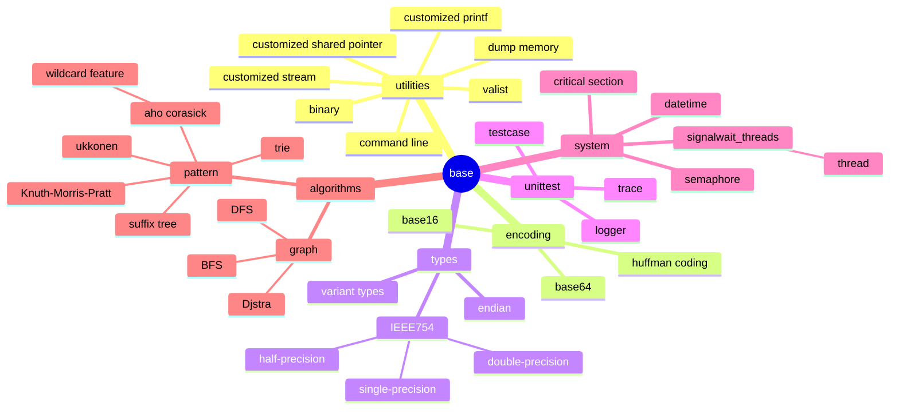

### base

### references

* books
  * Data Structures and Algorithm Analysis in C++
    * binary search tree
      * 4.3 The Search Tree ADT - Binary Search Trees
    * list, vector
      * 3 Lists, Stacks, and Queues
    * KMP
      * 12.3.3 The Knuth-Morris-Pratt Algorithm
    * priority queues
      * 6 Priority Queues (Heaps)
  * Data Structures and Algorithms in C++
* RFC
  * RFC 4648 The Base16, Base32, and Base64 Data Encodings
* online resources
  * aho-corasick
    * https://www.javatpoint.com/aho-corasick-algorithm-for-pattern-searching-in-cpp
    * unserstanding failure link and output
    * https://daniel.lawrence.lu/blog/y2014m03d25/
  * dijkstra
    * https://en.wikipedia.org/wiki/Dijkstra%27s_algorithm
  * graph
    * https://graphonline.ru/en/
  * pattern
    * https://www.geeksforgeeks.org/
  * suffix tree
    * https://www.geeksforgeeks.org/pattern-searching-using-trie-suffixes/
  * trie
    * https://www.geeksforgeeks.org/trie-data-structure-in-cpp/
    * https://www.geeksforgeeks.org/auto-complete-feature-using-trie/
  * ukkonen
    * https://www.geeksforgeeks.org/ukkonens-suffix-tree-construction-part-1/
    * https://brenden.github.io/ukkonen-animation/
    * https://programmerspatch.blogspot.com/2013/02/ukkonens-suffix-tree-algorithm.html
  * wildcard
    * https://www.geeksforgeeks.org/wildcard-pattern-matching/?ref=lbp
