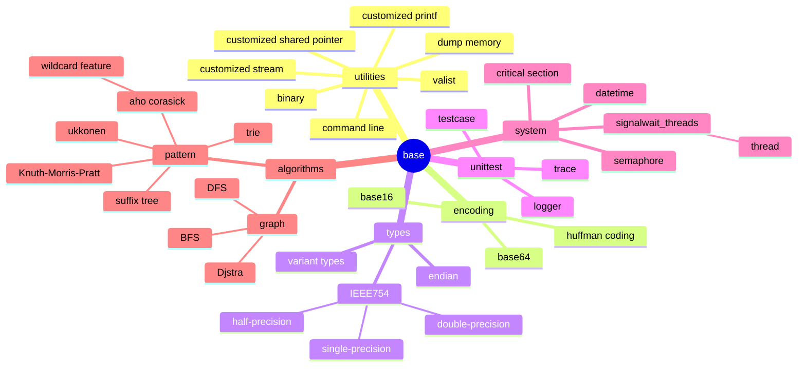

### base

```mermaid
mindmap
  root((base))
    utilities
      dump memory
      command line
      binary
      customized printf
      customized stream
      customized shared pointer
      valist
    encoding
      base16
      base64
      huffman coding
    types
      endian
      variant types
      IEEE754
        half-precision
        single-precision
        double-precision
    unittest
      testcase
      logger
      trace
    system
      critical section
      semaphore
      datetime
      signalwait_threads
        thread
    algorithms
      pattern
        Knuth-Morris-Pratt
        trie
        suffix tree
        ukkonen
        aho corasick
          wildcard feature
      graph
        BFS
        DFS
        Djstra
```