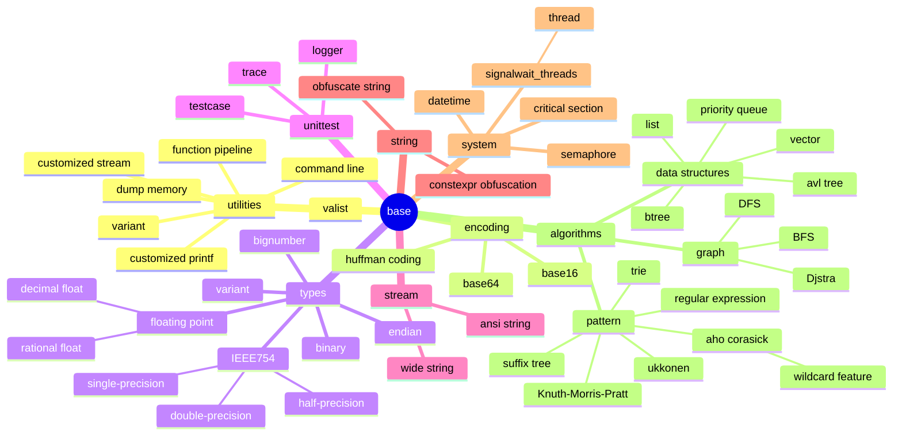

#### base

```mermaid
mindmap
  root((base))
    utilities
      command line
      customized printf
      customized stream
      dump memory
      function pipeline
      variant
      valist
    encoding
      base16
      base64
      huffman coding
    types
      binary
      endian
      variant
      IEEE754
        half-precision
        single-precision
        double-precision
      bignumber
      floating point
        decimal float
        rational float
    unittest
      testcase
      logger
      trace
    stream
      ansi string
      wide string
    string
      constexpr obfuscation
      obfuscate string
    system
      critical section
      semaphore
      datetime
      signalwait_threads
        thread
    algorithms
      data structures
        avl tree
        btree
        list
        priority queue
        vector
      pattern
        Knuth-Morris-Pratt
        trie
        suffix tree
        ukkonen
        aho corasick
          wildcard feature
        regular expression
      graph
        BFS
        DFS
        Djstra
```

#### references

* books
  * Data Structures and Algorithm Analysis in C++
    * binary search tree
      * 4.3 The Search Tree ADT - Binary Search Trees
    * list, vector
      * 3 Lists, Stacks, and Queues
    * KMP
      * 12.3.3 The Knuth-Morris-Pratt Algorithm
    * priority queues
      * 6 Priority Queues (Heaps)
  * Data Structures and Algorithms in C++
* RFC
  * RFC 4648 The Base16, Base32, and Base64 Data Encodings
* articles
  * http://stackoverflow.com/questions/11695237/creating-va-list-dynamically-in-gcc-can-it-be-done
* online resources
  * aho-corasick
    * https://www.javatpoint.com/aho-corasick-algorithm-for-pattern-searching-in-cpp
    * unserstanding failure link and output
    * https://daniel.lawrence.lu/blog/y2014m03d25/
  * dijkstra
    * https://en.wikipedia.org/wiki/Dijkstra%27s_algorithm
  * graph
    * https://graphonline.ru/en/
  * pattern
    * https://www.geeksforgeeks.org/
  * suffix tree
    * https://www.geeksforgeeks.org/pattern-searching-using-trie-suffixes/
  * trie
    * https://www.geeksforgeeks.org/trie-data-structure-in-cpp/
    * https://www.geeksforgeeks.org/auto-complete-feature-using-trie/
  * ukkonen
    * https://www.geeksforgeeks.org/ukkonens-suffix-tree-construction-part-1/
    * https://brenden.github.io/ukkonen-animation/
    * https://programmerspatch.blogspot.com/2013/02/ukkonens-suffix-tree-algorithm.html
  * wildcard
    * https://www.geeksforgeeks.org/wildcard-pattern-matching/?ref=lbp
  * bignumber
    * https://www.calculator.net/big-number-calculator.html
  * The IEEE Standard for Floating-Point Arithmetic (IEEE 754)
    * https://en.wikipedia.org/wiki/IEEE_754
    * https://en.wikipedia.org/wiki/Floating-point_arithmetic
    * https://en.wikipedia.org/wiki/Half-precision_floating-point_format
    * https://en.wikipedia.org/wiki/Single-precision_floating-point_format
    * https://docs.oracle.com/cd/E19957-01/806-3568/ncg_goldberg.html
    * https://www.cl.cam.ac.uk/teaching/1011/FPComp/fpcomp10slides.pdf
    * https://www.youtube.com/watch?v=8afbTaA-gOQ
    * https://www.corsix.org/content/converting-fp32-to-fp16
    * https://blog.fpmurphy.com/2008/12/half-precision-floating-point-format_14.html
  * IEEE754 online converter
    * https://www.h-schmidt.net/FloatConverter/IEEE754.html
    * https://baseconvert.com/ieee-754-floating-point
    * https://www.omnicalculator.com/other/floating-point

#### C++ Standard

| C++ std | GCC   | reference                                             |
|--       |--     |--                                                     |
| c++0x   | 4.3~  |                                                       |
| c++11   | 4.7~  | https://en.cppreference.com/w/cpp/compiler_support/11 |
| c++1y   | 4.8~  |                                                       |
| c++14   | 5.1~  | https://en.cppreference.com/w/cpp/compiler_support/14 |
| c++1z   | 6.1~  |                                                       |
| c++17   | 7.1~  | https://en.cppreference.com/w/cpp/compiler_support/17 |
| c++2a   | 8.1~  |                                                       |
| c++20   | 10.1~ | https://en.cppreference.com/w/cpp/compiler_support/20 |
| c++23   | 11.1~ | https://en.cppreference.com/w/cpp/compiler_support/23 |

; https://gcc.gnu.org/projects/cxx-status.html

#### topic documents

* [constexpr-obfuscation](string/constexpr-obfuscation.md)
* [bignumber](system/bignumber.md)
