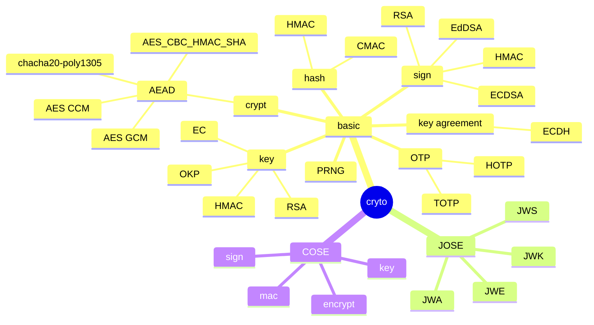

### crypto

### references

* books
  * Secure Programming Cookbook for C and C++ - O'REILLY
* RFC
  * RFC 2104 HMAC: Keyed-Hashing for Message Authentication
  * RFC 3394 Advanced Encryption Standard (AES) Key Wrap Algorithm (September 2002)
  * RFC 4226 HOTP: An HMAC-Based One-Time Password Algorithm
  * RFC 4493 The AES-CMAC Algorithm
  * RFC 5649 Advanced Encryption Starndard (AES) Key Wrap with Padding Algorithm (September 2009)
  * RFC 6070 PKCS #5: Password-Based Key Derivation Function 2 (PBKDF2)
  * RFC 6238 TOTP: Time-Based One-Time Password Algorithm
  * RFC 7515 JSON Web Signature (JWS)
  * RFC 7516 JSON Web Encryption (JWE)
  * RFC 7517 JSON Web Key (JWK)
  * RFC 7518 JSON Web Algorithms (JWA)
  * RFC 7520 Examples of Protecting Content Using JSON Object Signing and Encryption (JOSE)
  * RFC 7914 The scrypt Password-Based Key Derivation Function
  * RFC 8017 PKCS #1: RSA Cryptography Specifications Version 2.2
  * RFC 8037 CFRG Elliptic Curve Diffie-Hellman (ECDH) and Signatures in JSON Object Signing and Encryption (JOSE)
  * RFC 8152 CBOR Object Signing and Encryption (COSE)
  * RFC 9106 Argon2 Memory-Hard Function for Password Hashing and Proof-of-Work Applications
* online resources
  * Authenticated Encryption with AES-CBC and HMAC-SHA
    * https://www.ietf.org/archive/id/draft-mcgrew-aead-aes-cbc-hmac-sha2-05.txt
  * COSE
    * https://www.iana.org/assignments/cose/cose.xhtml
    * https://github.com/cose-wg/Examples
  * IANA
    * https://www.iana.org/assignments/tls-parameters/tls-parameters.xhtml
  * JSON parser performance comparison
    * https://github.com/miloyip/nativejson-benchmark
    * https://github.com/fabienrenaud/java-json-benchmark
  * openssl documentation
    * https://docs.openssl.org/master/man7/ossl-guide-libcrypto-introduction/
  * OID
    * https://oid-base.com/
  * standard curve database
    * https://neuromancer.sk/std/
