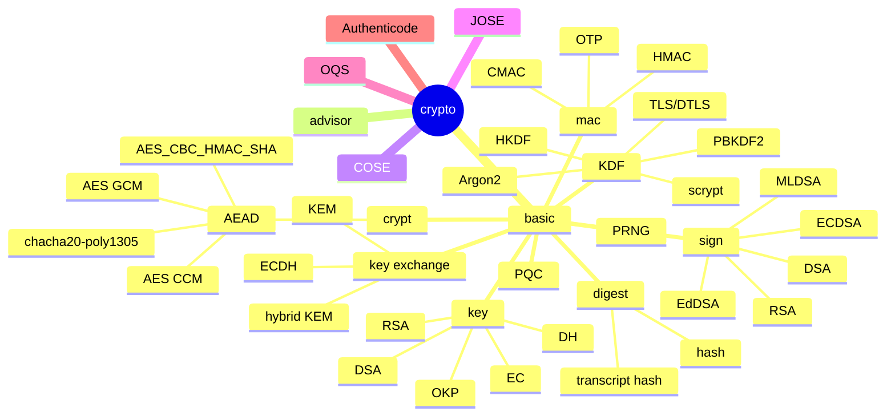

#### crypto

```mermaid
mindmap
  root((crypto))
    basic
      crypt
        AEAD
          AES GCM
          AES CCM
          chacha20-poly1305
          AES_CBC_HMAC_SHA
      digest
        hash
        transcript hash
      mac
        HMAC
        CMAC
        OTP
      sign
        DSA
        ECDSA
        EdDSA
        MLDSA
        RSA
      key
        DH
        DSA
        EC
        OKP
        RSA
      key exchange
        ECDH
        KEM
        hybrid KEM
      KDF
        HKDF
        PBKDF2
        scrypt
        Argon2
        TLS/DTLS
      PQC
      PRNG
    advisor
    COSE
    JOSE
    OQS
    Authenticode
```
