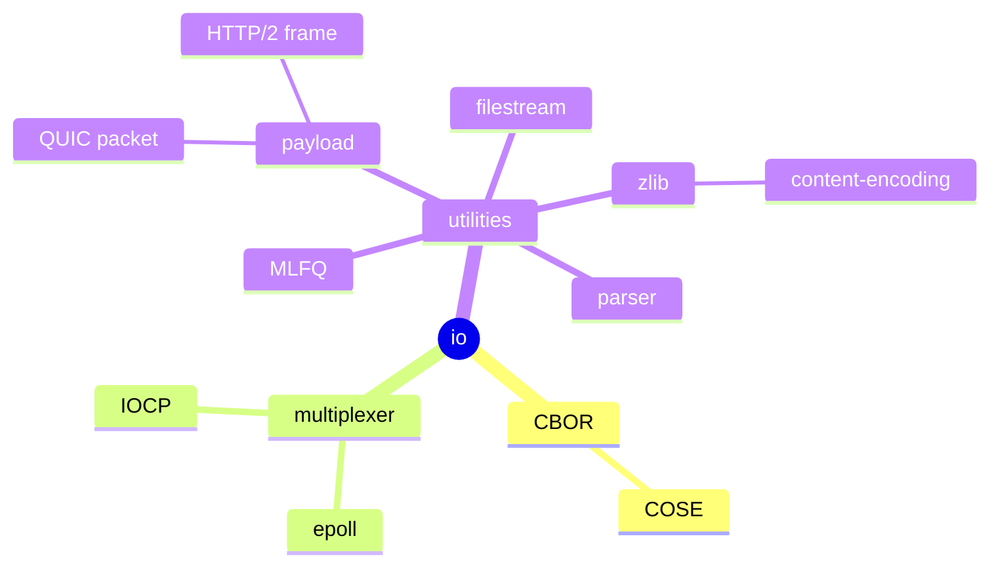

### io

```mermaid
mindmap
  root((io))
    CBOR
      COSE
    multiplexer
     epoll
     IOCP
    utilities
      payload
        HTTP/2 frame
        QUIC packet
      MLFQ
      parser
      zlib
        content-encoding
      filestream
```

### references

* books
* RFC
  * RFC 7049 Concise Binary Object Representation (CBOR)
  * RFC 8949 Concise Binary Object Representation (CBOR)
* online resources
