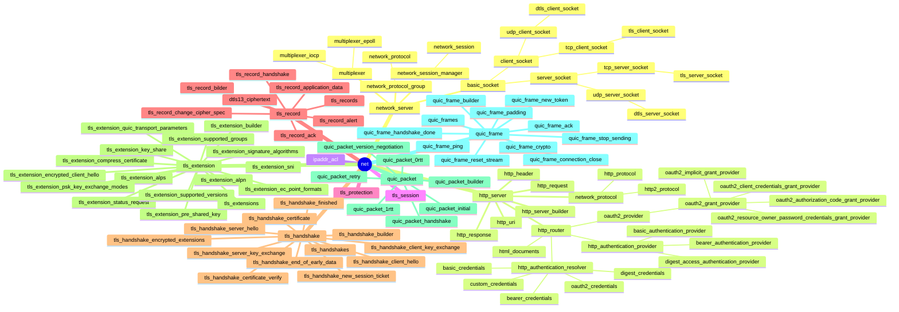

### network

### references

* books
* RFC
  * TLS
    * RFC 2246 The TLS Protocol Version 1.0
    * RFC 4346 The Transport Layer Security (TLS) Protocol Version 1.1
    * RFC 5246 The Transport Layer Security (TLS) Protocol Version 1.2
    * RFC 8446 The Transport Layer Security (TLS) Protocol Version 1.3
    * RFC 8448 Example Handshake Traces for TLS 1.3
  * DTLS
    * RFC 4347 Datagram Transport Layer Security
    * RFC 6347 Datagram Transport Layer Security Version 1.2
    * RFC 9147 The Datagram Transport Layer Security (DTLS) Protocol Version 1.3
  * QUIC
    * RFC 9000 QUIC: A UDP-Based Multiplexed and Secure Transport
    * RFC 9001 Using TLS to Secure QUIC
  * HTTP
    * RFC 2068 Hypertext Transfer Protocol -- HTTP/1.1
    * RFC 7540 Hypertext Transfer Protocol Version 2 (HTTP/2)
    * RFC 7541 HPACK: Header Compression for HTTP/2
    * RFC 9113 HTTP/2
    * RFC 9114 HTTP/3
    * RFC 9204 QPACK: Field Compression for HTTP/3
* online resources
  * The SSLKEYLOGFILE Format for TLS
    * https://www.ietf.org/archive/id/draft-thomson-tls-keylogfile-00.html
