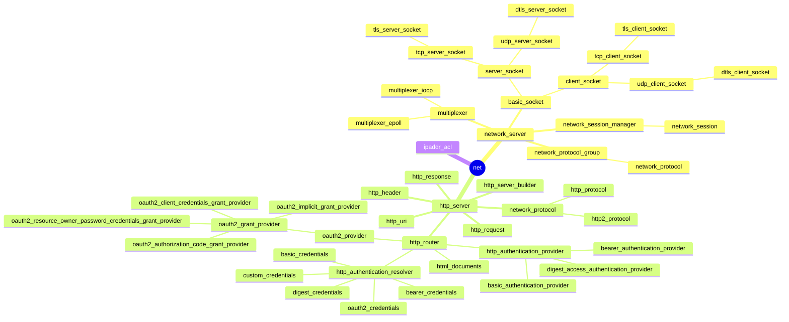

### network

```mermaid
mindmap
  root((net))
    network_server
      multiplexer
        multiplexer_epoll
        multiplexer_iocp
      network_protocol_group
        network_protocol
      network_session_manager
        network_session
      basic_socket
        server_socket
          tcp_server_socket
            tls_server_socket
          udp_server_socket
            dtls_server_socket
        client_socket
          tcp_client_socket
            tls_client_socket
          udp_client_socket
            dtls_client_socket
    http_server
      http_server_builder
      http_uri
      http_header
      network_protocol
        http_protocol
        http2_protocol
      http_request
      http_response
      http_router
        html_documents
        http_authentication_provider
          basic_authentication_provider
          digest_access_authentication_provider
          bearer_authentication_provider
        http_authentication_resolver
          basic_credentials
          digest_credentials
          bearer_credentials
          oauth2_credentials
          custom_credentials
        oauth2_provider
          oauth2_grant_provider
            oauth2_authorization_code_grant_provider
            oauth2_implicit_grant_provider
            oauth2_resource_owner_password_credentials_grant_provider
            oauth2_client_credentials_grant_provider
    ipaddr_acl
```
