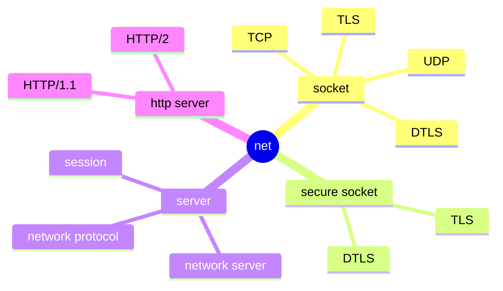

#### network

```mermaid
mindmap
  root((net))
    socket
      TCP
      UDP
      TLS
      DTLS
    secure socket
      TLS
      DTLS
    server
      network server
      network protocol
      session
    http server
      HTTP/1.1
      HTTP/2
```

#### references

* books
* RFC
  * TLS
    * RFC 2246 The TLS Protocol Version 1.0
    * RFC 4346 The Transport Layer Security (TLS) Protocol Version 1.1
    * RFC 5246 The Transport Layer Security (TLS) Protocol Version 1.2
    * RFC 8446 The Transport Layer Security (TLS) Protocol Version 1.3
    * RFC 8448 Example Handshake Traces for TLS 1.3
  * DTLS
    * RFC 4347 Datagram Transport Layer Security
    * RFC 6347 Datagram Transport Layer Security Version 1.2
    * RFC 9147 The Datagram Transport Layer Security (DTLS) Protocol Version 1.3
  * QUIC
    * RFC 9000 QUIC: A UDP-Based Multiplexed and Secure Transport
    * RFC 9001 Using TLS to Secure QUIC
  * HTTP
    * RFC 2068 Hypertext Transfer Protocol -- HTTP/1.1
    * RFC 7540 Hypertext Transfer Protocol Version 2 (HTTP/2)
    * RFC 7541 HPACK: Header Compression for HTTP/2
    * RFC 9113 HTTP/2
    * RFC 9114 HTTP/3
    * RFC 9204 QPACK: Field Compression for HTTP/3
* online resources
  * The Illustrated Connection
    * https://tls13.xargs.org/
    * https://tls12.xargs.org/
    * https://dtls.xargs.org/
    * https://quic.xargs.org/
  * ciphersuites
    * https://ciphersuite.info/cs/
    * https://docs.openssl.org/1.1.1/man1/ciphers/
  * IANA
    * https://www.iana.org/assignments/aead-parameters/aead-parameters.xhtml
    * https://www.iana.org/assignments/tls-extensiontype-values/tls-extensiontype-values.xhtml
    * https://www.iana.org/assignments/tls-parameters/tls-parameters.xhtml
    * https://www.iana.org/assignments/quic/quic.xhtml
  * samplepackets
    * https://wiki.wireshark.org/samplecaptures
  * The SSLKEYLOGFILE Format for TLS
    * https://www.ietf.org/archive/id/draft-thomson-tls-keylogfile-00.html

#### related implementation

* [basic](basic/README.md) - socket and secure socket implementations
* [server](server/README.md) - network server, multiplexer and session management
* [http](http/README.md) - HTTP/1.x, HTTP/2 and HTTP/3 related implementation
* [tls](tls/README.md) - TLS/DTLS/QUIC implementation and protocol study

#### related tests

* [network testcase](../../test/testcase/net/README.md)
* [TLS testcase](../../test/testcase/tls/README.md)
* [HPACK testcase](../../test/testcase/net/hpack/README.md)
* [QPACK testcase](../../test/testcase/net/qpack/README.md)

#### related areas

* `sdk/crypto/` - cryptographic primitives and protocol cryptography used by TLS/QUIC/HTTP authentication
* `sdk/io/` - parser, encoding and binary data handling used by network protocols
* `sdk/base/` - streams, strings, system utilities and common runtime support
