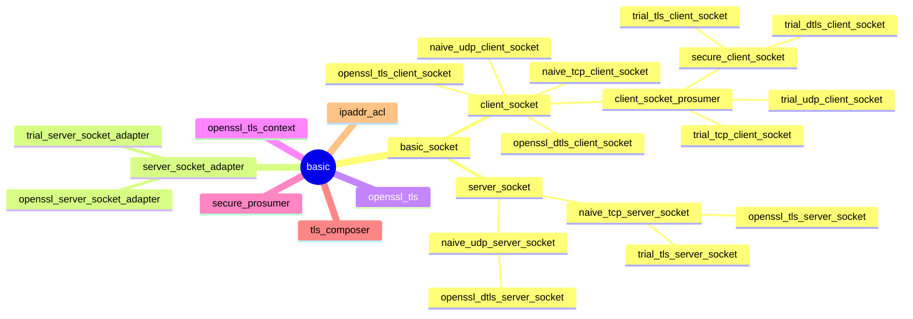

### socket

```mermaid
mindmap
  root((basic))
    basic_socket
      client_socket
        naive_tcp_client_socket
        naive_udp_client_socket
        openssl_tls_client_socket
        openssl_dtls_client_socket
        client_socket_prosumer
          secure_client_socket
            trial_tls_client_socket
            trial_dtls_client_socket
          trial_tcp_client_socket
          trial_udp_client_socket
      server_socket
        naive_tcp_server_socket
          openssl_tls_server_socket
          trial_tls_server_socket
        naive_udp_server_socket
          openssl_dtls_server_socket
    server_socket_adapter
      openssl_server_socket_adapter
      trial_server_socket_adapter
    openssl_tls
    openssl_tls_context
    secure_prosumer
    tls_composer
    ipaddr_acl
```
