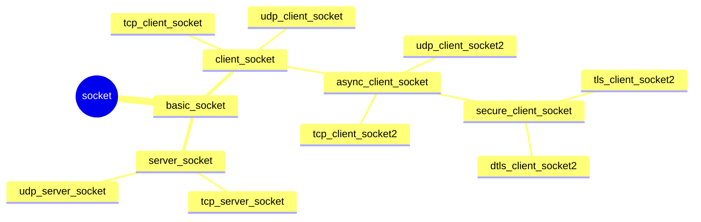

### socket

```mermaid
mindmap
  root((socket))
    basic_socket
      client_socket
        tcp_client_socket
        udp_client_socket
        async_client_socket
          tcp_client_socket2
          udp_client_socket2
          secure_client_socket
            tls_client_socket2
            dtls_client_socket2
      server_socket
        tcp_server_socket
        udp_server_socket
```
