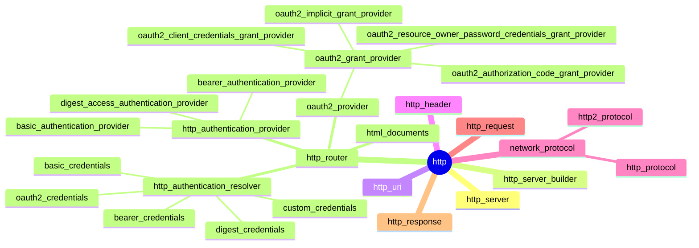

### HTTP

- [x] HTTP/1.1
  - [x] Basic and Digest Access Authentication
  - [x] HTTP/1.1 simple server
- [x] HTTP/2
  - [x] HPACK
  - [x] HTTP/2 simple server
    - [x] server push
- [ ] HTTP/3
  - [x] QPACK
  - [ ] QUIC
  - [ ] HTTP/3 simple server

### HTTP/1.0
  - one request per connection
  - problem of RTT (packet round-trip time)
    - HTTP/1.1 Persistent Connection

### HTTP/1.1
  - Persistent Connection
    - keep-alive option
  - pipelining
    - client sends requests sequentially wo waiting for a response to the previous request
    - server responds in the order in which the requests were received
  - problem of TCP HOLB (Head of Line Blocking)
    - if the response to the previous request is delayed, all subsequent requests are blocked and the response is delayed
    - HTTP/2.0 SPDY, HTTP/3.0 QUIC

### HTTP/2.0
  - Multiplexed streams
    - SPDY (TCP-based)
    - problem of HOLB still exists
  - Head Compression
  - Server Push

### HTTP/3.0
  - QUIC (UDP-based)

### comments

| compression      |                       | compression                        |               |
| --               | --                    | --                                 | --            |
| deflate          | TLS-level compression | LZ77 + Huffman coding              | CRIME attack  |
| gzip             | content-encoding      | LZ77 + Huffman coding              | BREACH attack |
| deflate          | content-encoding      | LZ77 + Huffman coding              | BREACH attack |
| br               | content-encoding      | LZ77 + Huffman + Context Modeling  | BREACH attack |
| zstd             | content-encoding      | LZ77 + Finite State Entropy        |               |
| identity         | content-encoding      | N/A                                |               |
