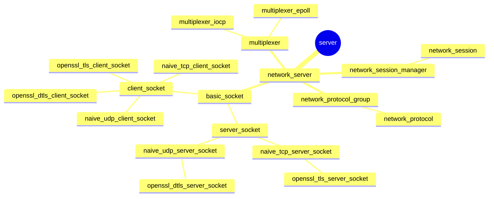

#### server




#### network_server

| dev    | support | platform |
| --     | --      | --       |
| epoll  |    O    | linux    |
| iocp   |    O    | windows  |
| kqueue |    X    |          |

````
muliplexer
  event_loop_run
    event_callback_routine(is_dgram ? mux_dgram : mux_read, ...)

network_server
  accept_thread (multiplicity:1)
    server_socket->accept
    accept_control_handler
    if (server_socket->support_tls()) {
      accept_queue.push
    } else {
      // case TCP
      session_accepted(new socket_handle, ...)
    }
  tls_accept_thread (multiplicity:1..*)
    // case TLS
    accept_queue.pop
    server_socket->tls_accept(&socket_handle, ...)
      new socket_handle
    session_accepted(socket_handle, ...)
  producer_thread (multiplicity:1..*)
    if (mux_read == type)
      sesson_manager.find(client_socket, &session_object);
      session_object->produce
      session_object->release
    } else if (mux_dgram == type) {
      session_manager.get_dgram_session(&dgram_session, ...)
      if (server_socket->support_tls()) {
        // case DTLS
        session_manager.get_dgram_cookie_session(&dtls_session, ...)
          dtls_session->dtls_session_open
            server_socket->dtls_open(&socket_handle)
              new socket_handle
        dtls_session->produce
        dtls_session->release()
      } else {
        // case UDP
        dgram_session->udp_session_open
          new socket_handle
        dgram_session->produce
      }
    }
  consumer_thread (multiplicity:1..*)
````
