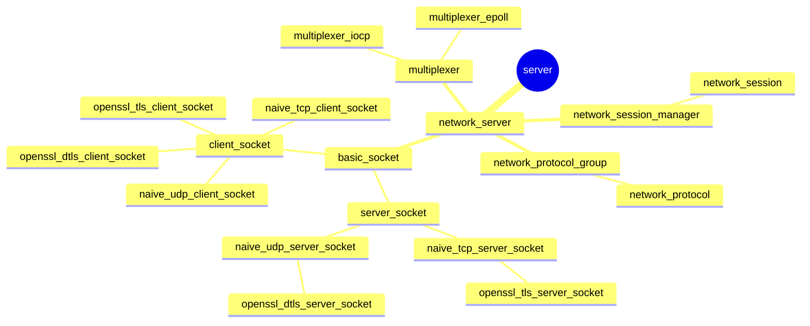

# Server mindmap

```mermaid
mindmap
  root((server))
    network_server
      multiplexer
        multiplexer_epoll
        multiplexer_iocp
      network_protocol_group
        network_protocol
      network_session_manager
        network_session
      basic_socket
        server_socket
          naive_tcp_server_socket
            openssl_tls_server_socket
          naive_udp_server_socket
            openssl_dtls_server_socket
        client_socket
          naive_tcp_client_socket
          openssl_tls_client_socket
          naive_udp_client_socket
          openssl_dtls_client_socket
```
