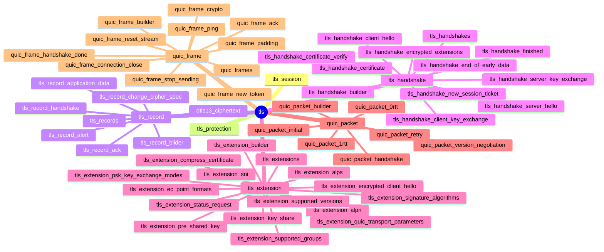

### understanding TLS

* TLS references
  * RFC 8446 The Transport Layer Security (TLS) Protocol Version 1.3
  * RFC 8446 Example Handshake Traces for TLS 1.3
  * https://tls13.xargs.org/
  * https://tls12.xargs.org/
  * https://dtls.xargs.org/
  * https://quic.xargs.org/
  * https://ciphersuite.info/cs/
  * https://wiki.wireshark.org/samplecaptures

* understanding TLS - DTLS - QUIC step by step
  1. https://tls13.xargs.org/
  2. https://tls12.xargs.org/
  3. https://dtls.xargs.org/
  4. RFC 9001
  5. https://quic.xargs.org/

### TLS



#### RFC 8446 Figure 1: Message Flow for Full TLS Handshake
````
       Client                                           Server

Key  ^ ClientHello
Exch | + key_share*
     | + signature_algorithms*
     | + psk_key_exchange_modes*
     v + pre_shared_key*       -------->
                                                  ServerHello  ^ Key
                                                 + key_share*  | Exch
                                            + pre_shared_key*  v
                                        {EncryptedExtensions}  ^  Server
                                        {CertificateRequest*}  v  Params
                                               {Certificate*}  ^
                                         {CertificateVerify*}  | Auth
                                                   {Finished}  v
                               <--------  [Application Data*]
     ^ {Certificate*}
Auth | {CertificateVerify*}
     v {Finished}              -------->
       [Application Data]      <------->  [Application Data]

              +  Indicates noteworthy extensions sent in the
                 previously noted message.

              *  Indicates optional or situation-dependent
                 messages/extensions that are not always sent.

              {} Indicates messages protected using keys
                 derived from a [sender]_handshake_traffic_secret.

              [] Indicates messages protected using keys
                 derived from [sender]_application_traffic_secret_N.

               Figure 1: Message Flow for Full TLS Handshake
````

#### RFC 8446 Figure 2: Message Flow for a Full Handshake with Mismatched Parameters
````
        Client                                               Server

        ClientHello
        + key_share             -------->
                                                  HelloRetryRequest
                                <--------               + key_share
        ClientHello
        + key_share             -------->
                                                        ServerHello
                                                        + key_share
                                              {EncryptedExtensions}
                                              {CertificateRequest*}
                                                     {Certificate*}
                                               {CertificateVerify*}
                                                         {Finished}
                                <--------       [Application Data*]
        {Certificate*}
        {CertificateVerify*}
        {Finished}              -------->
        [Application Data]      <------->        [Application Data]

             Figure 2: Message Flow for a Full Handshake with
                           Mismatched Parameters
````

#### RFC 8446 Figure 3: Message Flow for Resumption and PSK
````

          Client                                               Server

   Initial Handshake:
          ClientHello
          + key_share               -------->
                                                          ServerHello
                                                          + key_share
                                                {EncryptedExtensions}
                                                {CertificateRequest*}
                                                       {Certificate*}
                                                 {CertificateVerify*}
                                                           {Finished}
                                    <--------     [Application Data*]
          {Certificate*}
          {CertificateVerify*}
          {Finished}                -------->
                                    <--------      [NewSessionTicket]
          [Application Data]        <------->      [Application Data]


   Subsequent Handshake:
          ClientHello
          + key_share*
          + pre_shared_key          -------->
                                                          ServerHello
                                                     + pre_shared_key
                                                         + key_share*
                                                {EncryptedExtensions}
                                                           {Finished}
                                    <--------     [Application Data*]
          {Finished}                -------->
          [Application Data]        <------->      [Application Data]

               Figure 3: Message Flow for Resumption and PSK
````

#### RFC 8446 Figure 4: Message Flow for a 0-RTT Handshake
````
         Client                                               Server

         ClientHello
         + early_data
         + key_share*
         + psk_key_exchange_modes
         + pre_shared_key
         (Application Data*)     -------->
                                                         ServerHello
                                                    + pre_shared_key
                                                        + key_share*
                                               {EncryptedExtensions}
                                                       + early_data*
                                                          {Finished}
                                 <--------       [Application Data*]
         (EndOfEarlyData)
         {Finished}              -------->
         [Application Data]      <------->        [Application Data]

               +  Indicates noteworthy extensions sent in the
                  previously noted message.

               *  Indicates optional or situation-dependent
                  messages/extensions that are not always sent.

               () Indicates messages protected using keys
                  derived from a client_early_traffic_secret.

               {} Indicates messages protected using keys
                  derived from a [sender]_handshake_traffic_secret.

               [] Indicates messages protected using keys
                  derived from [sender]_application_traffic_secret_N.

               Figure 4: Message Flow for a 0-RTT Handshake

````
#### RFC 9147 Figure 2: DTLS 1.3 Record Formats
````
       struct {
           ContentType type;
           ProtocolVersion legacy_record_version;
           uint16 epoch = 0
           uint48 sequence_number;
           uint16 length;
           opaque fragment[DTLSPlaintext.length];
       } DTLSPlaintext;

       struct {
            opaque content[DTLSPlaintext.length];
            ContentType type;
            uint8 zeros[length_of_padding];
       } DTLSInnerPlaintext;

       struct {
           opaque unified_hdr[variable];
           opaque encrypted_record[length];
       } DTLSCiphertext;

                     Figure 2: DTLS 1.3 Record Formats
````
#### RFC 9147 Figure 3: DTLS 1.3 Unified Header
````
       0 1 2 3 4 5 6 7
       +-+-+-+-+-+-+-+-+
       |0|0|1|C|S|L|E E|
       +-+-+-+-+-+-+-+-+
       | Connection ID |   Legend:
       | (if any,      |
       /  length as    /   C   - Connection ID (CID) present
       |  negotiated)  |   S   - Sequence number length
       +-+-+-+-+-+-+-+-+   L   - Length present
       |  8 or 16 bit  |   E   - Epoch
       |Sequence Number|
       +-+-+-+-+-+-+-+-+
       | 16 bit Length |
       | (if present)  |
       +-+-+-+-+-+-+-+-+

                     Figure 3: DTLS 1.3 Unified Header
````
#### RFC 9147 Figure 4: DTLS 1.3 Header Examples
````
    0 1 2 3 4 5 6 7       0 1 2 3 4 5 6 7       0 1 2 3 4 5 6 7
   +-+-+-+-+-+-+-+-+     +-+-+-+-+-+-+-+-+     +-+-+-+-+-+-+-+-+
   | Content Type  |     |0|0|1|1|1|1|E E|     |0|0|1|0|0|0|E E|
   +-+-+-+-+-+-+-+-+     +-+-+-+-+-+-+-+-+     +-+-+-+-+-+-+-+-+
   |   16 bit      |     |               |     |8 bit Seq. No. |
   |   Version     |     / Connection ID /     +-+-+-+-+-+-+-+-+
   +-+-+-+-+-+-+-+-+     |               |     |               |
   |   16 bit      |     +-+-+-+-+-+-+-+-+     |   Encrypted   |
   |    Epoch      |     |    16 bit     |     /   Record      /
   +-+-+-+-+-+-+-+-+     |Sequence Number|     |               |
   |               |     +-+-+-+-+-+-+-+-+     +-+-+-+-+-+-+-+-+
   |               |     |   16 bit      |
   |   48 bit      |     |   Length      |       DTLSCiphertext
   |Sequence Number|     +-+-+-+-+-+-+-+-+         Structure
   |               |     |               |         (minimal)
   |               |     |  Encrypted    |
   +-+-+-+-+-+-+-+-+     /  Record       /
   |    16 bit     |     |               |
   |    Length     |     +-+-+-+-+-+-+-+-+
   +-+-+-+-+-+-+-+-+
   |               |      DTLSCiphertext
   |               |        Structure
   /   Fragment    /          (full)
   |               |
   +-+-+-+-+-+-+-+-+

    DTLSPlaintext
      Structure

                     Figure 4: DTLS 1.3 Header Examples
````

#### summarize the complex calculation process

|                     |         |                           |
| --                  | --      | --                        |
| client_key_exchange | TLS 1.2 | pre-master secret         |
| key_share           | TLS 1.3 | ECDHE                     |
| pre_shared_key      | TLS 1.3 | session-resumption, 0-RTT |

```
case client_hello
  case extension.key_share
    generate keypair
    send keypair.pubkey
  end
end

case server_hello
  case extension.key_share
    generate keypair
    send keypair.pubkey
    shared_secret = Diffie-Hellman(keypair.privkey, keypair.pubkey)
  end
  early_secret = Extract(hashalg, salt, empty_ikm)
  case 1-RTT, HRR:
    secret_handshake_derived = Expand-Label(hashalg, dlen, early_secret, "derived", empty_hash)
    secret_handshake = Extract(hashalg, secret_handshake_derived, shared_secret);
  case 0-RTT:
    secret_handshake_derived = Expand-Label(hashalg, dlen, secret_resumption_early, "derived", empty_hash)
    secret_handshake = Extract(hashalg, secret_handshake_derived, shared_secret);
  end
  secret_c_hs_traffic = Expand-Label(hashalg, dlen, secret, handshake, "c hs traffic", context_hash)
  secret_s_hs_traffic = Expand-Label(hashalg, dlen, secret, handshake, "s hs traffic", context_hash)
end

case certificate
  send certificate
end

case server_key_exchange
  case server:
    // signature algorithm (same kty of certificate)
    sign(certificate-privkey, client_hello_random + server_hello_random + curve_info + public_key)
  case client:
    verify(certificate, client_hello_random + server_hello_random + curve_info + public_key)
end

// client_key_exchange and then change_cipher_spec, encrypt and decrypt application_data
case client_key_exchange
  case client:
    generate keypair
    send keypair.pubkey
  case server:
    pre_master_secret = Diffie-Hellman(keypair.privkey, keypair.pubkey);
    // RFC 2246 5. HMAC and the pseudorandom function
    // RFC 2246 8.1. Computing the master secret
    master_secret = PRF(pre_master_secret, "master secret",
                        ClientHello.random + ServerHello.random)
                        [0..47];
    // RFC 2246 5. HMAC and the pseudorandom function
    // RFC 5246 5.  HMAC and the Pseudorandom Function
    P_hash(secret, seed) = HMAC_hash(secret, A(1) + seed) +
                           HMAC_hash(secret, A(2) + seed) +
                           HMAC_hash(secret, A(3) + seed) + ...
    A() is defined as:
        A(0) = seed
        A(i) = HMAC_hash(secret, A(i-1))
    PRF(secret, label, seed) = P_<hash>(secret, label + seed)
    // RFC 2246 5. HMAC and the pseudorandom function
    // RFC 2246 6.3. Key calculation
    key_block = PRF(SecurityParameters.master_secret,
                       "key expansion",
                       SecurityParameters.server_random +
                       SecurityParameters.client_random);
    client_write_MAC_secret[SecurityParameters.hash_size]
    server_write_MAC_secret[SecurityParameters.hash_size]
    client_write_key[SecurityParameters.key_material_length]
    server_write_key[SecurityParameters.key_material_length]
    client_write_IV[SecurityParameters.IV_size]
    server_write_IV[SecurityParameters.IV_size]
  end
end
```
