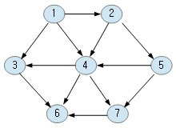
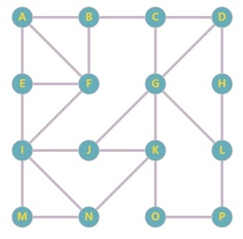
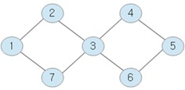

```
path[1->2] 1 -> 2 (distance : 1)
path[1->3] 1 -> 3 (distance : 1)
path[1->4] 1 -> 4 (distance : 1)
path[1->5] 1 -> 2 -> 5 (distance : 2)
path[1->6] 1 -> 3 -> 6 (distance : 2)
path[1->6] 1 -> 4 -> 6 (distance : 2)
path[1->7] 1 -> 4 -> 7 (distance : 2)

path[2->3] 2 -> 4 -> 3 (distance : 2)
path[2->4] 2 -> 4 (distance : 1)
path[2->5] 2 -> 5 (distance : 1)
path[2->6] 2 -> 4 -> 6 (distance : 2)
path[2->7] 2 -> 4 -> 7 (distance : 2)
path[2->7] 2 -> 5 -> 7 (distance : 2)

path[3->6] 3 -> 6 (distance : 1)

path[4->3] 4 -> 3 (distance : 1)
path[4->6] 4 -> 6 (distance : 1)
path[4->7] 4 -> 7 (distance : 1)

path[5->3] 5 -> 4 -> 3 (distance : 2)
path[5->4] 5 -> 4 (distance : 1)
path[5->6] 5 -> 4 -> 6 (distance : 2)
path[5->6] 5 -> 7 -> 6 (distance : 2)
path[5->7] 5 -> 7 (distance : 1)

path[7->6] 7 -> 6 (distance : 1)

```


```
path[0->1] 0 -> 1 (distance : 4)
path[0->2] 0 -> 1 -> 2 (distance : 12)
path[0->3] 0 -> 1 -> 2 -> 3 (distance : 19)
path[0->4] 0 -> 7 -> 6 -> 5 -> 4 (distance : 21)
path[0->5] 0 -> 7 -> 6 -> 5 (distance : 11)
path[0->6] 0 -> 7 -> 6 (distance : 9)
path[0->7] 0 -> 7 (distance : 8)
path[0->8] 0 -> 1 -> 2 -> 8 (distance : 14)

path[1->0] 1 -> 0 (distance : 4)
path[1->2] 1 -> 2 (distance : 8)
path[1->3] 1 -> 2 -> 3 (distance : 15)
path[1->4] 1 -> 2 -> 5 -> 4 (distance : 22)
path[1->5] 1 -> 2 -> 5 (distance : 12)
path[1->6] 1 -> 7 -> 6 (distance : 12)
path[1->7] 1 -> 7 (distance : 11)
path[1->8] 1 -> 2 -> 8 (distance : 10)

path[2->0] 2 -> 1 -> 0 (distance : 12)
path[2->1] 2 -> 1 (distance : 8)
path[2->3] 2 -> 3 (distance : 7)
path[2->4] 2 -> 5 -> 4 (distance : 14)
path[2->5] 2 -> 5 (distance : 4)
path[2->6] 2 -> 5 -> 6 (distance : 6)
path[2->7] 2 -> 5 -> 6 -> 7 (distance : 7)
path[2->8] 2 -> 8 (distance : 2)

path[3->0] 3 -> 2 -> 1 -> 0 (distance : 19)
path[3->1] 3 -> 2 -> 1 (distance : 15)
path[3->2] 3 -> 2 (distance : 7)
path[3->4] 3 -> 4 (distance : 9)
path[3->5] 3 -> 2 -> 5 (distance : 11)
path[3->6] 3 -> 2 -> 5 -> 6 (distance : 13)
path[3->7] 3 -> 2 -> 5 -> 6 -> 7 (distance : 14)
path[3->8] 3 -> 2 -> 8 (distance : 9)

path[4->0] 4 -> 5 -> 6 -> 7 -> 0 (distance : 21)
path[4->1] 4 -> 5 -> 2 -> 1 (distance : 22)
path[4->2] 4 -> 5 -> 2 (distance : 14)
path[4->3] 4 -> 3 (distance : 9)
path[4->5] 4 -> 5 (distance : 10)
path[4->6] 4 -> 5 -> 6 (distance : 12)
path[4->7] 4 -> 5 -> 6 -> 7 (distance : 13)
path[4->8] 4 -> 5 -> 2 -> 8 (distance : 16)

path[5->0] 5 -> 6 -> 7 -> 0 (distance : 11)
path[5->1] 5 -> 2 -> 1 (distance : 12)
path[5->2] 5 -> 2 (distance : 4)
path[5->3] 5 -> 2 -> 3 (distance : 11)
path[5->4] 5 -> 4 (distance : 10)
path[5->6] 5 -> 6 (distance : 2)
path[5->7] 5 -> 6 -> 7 (distance : 3)
path[5->8] 5 -> 2 -> 8 (distance : 6)

path[6->0] 6 -> 7 -> 0 (distance : 9)
path[6->1] 6 -> 7 -> 1 (distance : 12)
path[6->2] 6 -> 5 -> 2 (distance : 6)
path[6->3] 6 -> 5 -> 2 -> 3 (distance : 13)
path[6->4] 6 -> 5 -> 4 (distance : 12)
path[6->5] 6 -> 5 (distance : 2)
path[6->7] 6 -> 7 (distance : 1)
path[6->8] 6 -> 8 (distance : 6)

path[7->0] 7 -> 0 (distance : 8)
path[7->1] 7 -> 1 (distance : 11)
path[7->2] 7 -> 6 -> 5 -> 2 (distance : 7)
path[7->3] 7 -> 6 -> 5 -> 2 -> 3 (distance : 14)
path[7->4] 7 -> 6 -> 5 -> 4 (distance : 13)
path[7->5] 7 -> 6 -> 5 (distance : 3)
path[7->6] 7 -> 6 (distance : 1)
path[7->8] 7 -> 8 (distance : 7)
path[7->8] 7 -> 6 -> 8 (distance : 7)

path[8->0] 8 -> 2 -> 1 -> 0 (distance : 14)
path[8->1] 8 -> 2 -> 1 (distance : 10)
path[8->2] 8 -> 2 (distance : 2)
path[8->3] 8 -> 2 -> 3 (distance : 9)
path[8->4] 8 -> 2 -> 5 -> 4 (distance : 16)
path[8->5] 8 -> 2 -> 5 (distance : 6)
path[8->6] 8 -> 6 (distance : 6)
path[8->7] 8 -> 7 (distance : 7)
path[8->7] 8 -> 6 -> 7 (distance : 7)
```



```
path[A->P] A -> B -> C -> G -> L -> P (distance : 5)

```



```
path[1->2] 1 -> 2 (distance : 1)
path[1->3] 1 -> 2 -> 3 (distance : 2)
path[1->3] 1 -> 7 -> 3 (distance : 2)
path[1->4] 1 -> 2 -> 3 -> 4 (distance : 3)
path[1->4] 1 -> 7 -> 3 -> 4 (distance : 3)
path[1->5] 1 -> 2 -> 3 -> 4 -> 5 (distance : 4)
path[1->5] 1 -> 2 -> 3 -> 6 -> 5 (distance : 4)
path[1->5] 1 -> 7 -> 3 -> 4 -> 5 (distance : 4)
path[1->5] 1 -> 7 -> 3 -> 6 -> 5 (distance : 4)
path[1->6] 1 -> 2 -> 3 -> 6 (distance : 3)
path[1->6] 1 -> 7 -> 3 -> 6 (distance : 3)
path[1->7] 1 -> 7 (distance : 1)

path[2->1] 2 -> 1 (distance : 1)
path[2->3] 2 -> 3 (distance : 1)
path[2->4] 2 -> 3 -> 4 (distance : 2)
path[2->5] 2 -> 3 -> 4 -> 5 (distance : 3)
path[2->5] 2 -> 3 -> 6 -> 5 (distance : 3)
path[2->6] 2 -> 3 -> 6 (distance : 2)
path[2->7] 2 -> 1 -> 7 (distance : 2)
path[2->7] 2 -> 3 -> 7 (distance : 2)

path[3->1] 3 -> 2 -> 1 (distance : 2)
path[3->1] 3 -> 7 -> 1 (distance : 2)
path[3->2] 3 -> 2 (distance : 1)
path[3->4] 3 -> 4 (distance : 1)
path[3->5] 3 -> 4 -> 5 (distance : 2)
path[3->5] 3 -> 6 -> 5 (distance : 2)
path[3->6] 3 -> 6 (distance : 1)
path[3->7] 3 -> 7 (distance : 1)

path[4->1] 4 -> 3 -> 2 -> 1 (distance : 3)
path[4->1] 4 -> 3 -> 7 -> 1 (distance : 3)
path[4->2] 4 -> 3 -> 2 (distance : 2)
path[4->3] 4 -> 3 (distance : 1)
path[4->5] 4 -> 5 (distance : 1)
path[4->6] 4 -> 3 -> 6 (distance : 2)
path[4->6] 4 -> 5 -> 6 (distance : 2)
path[4->7] 4 -> 3 -> 7 (distance : 2)

path[5->1] 5 -> 4 -> 3 -> 2 -> 1 (distance : 4)
path[5->1] 5 -> 4 -> 3 -> 7 -> 1 (distance : 4)
path[5->1] 5 -> 6 -> 3 -> 2 -> 1 (distance : 4)
path[5->1] 5 -> 6 -> 3 -> 7 -> 1 (distance : 4)
path[5->2] 5 -> 4 -> 3 -> 2 (distance : 3)
path[5->2] 5 -> 6 -> 3 -> 2 (distance : 3)
path[5->3] 5 -> 4 -> 3 (distance : 2)
path[5->3] 5 -> 6 -> 3 (distance : 2)
path[5->4] 5 -> 4 (distance : 1)
path[5->6] 5 -> 6 (distance : 1)
path[5->7] 5 -> 4 -> 3 -> 7 (distance : 3)
path[5->7] 5 -> 6 -> 3 -> 7 (distance : 3)

path[6->1] 6 -> 3 -> 2 -> 1 (distance : 3)
path[6->1] 6 -> 3 -> 7 -> 1 (distance : 3)
path[6->2] 6 -> 3 -> 2 (distance : 2)
path[6->3] 6 -> 3 (distance : 1)
path[6->4] 6 -> 3 -> 4 (distance : 2)
path[6->4] 6 -> 5 -> 4 (distance : 2)
path[6->5] 6 -> 5 (distance : 1)
path[6->7] 6 -> 3 -> 7 (distance : 2)

path[7->1] 7 -> 1 (distance : 1)
path[7->2] 7 -> 1 -> 2 (distance : 2)
path[7->2] 7 -> 3 -> 2 (distance : 2)
path[7->3] 7 -> 3 (distance : 1)
path[7->4] 7 -> 3 -> 4 (distance : 2)
path[7->5] 7 -> 3 -> 4 -> 5 (distance : 3)
path[7->5] 7 -> 3 -> 6 -> 5 (distance : 3)
path[7->6] 7 -> 3 -> 6 (distance : 2)
```
